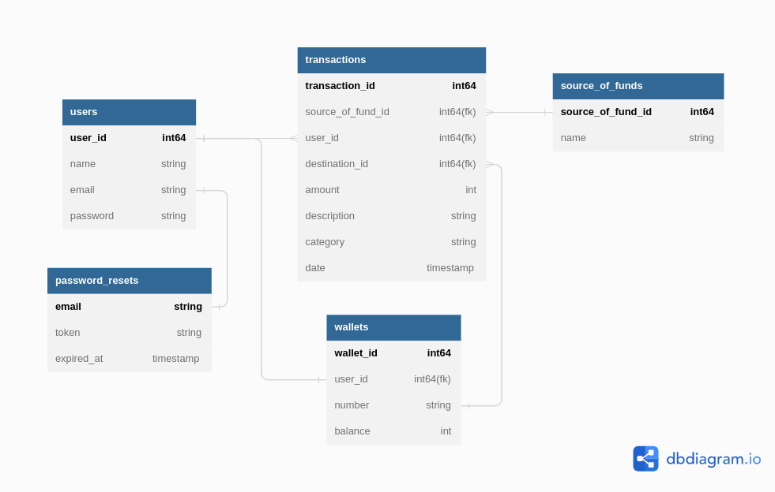

# E-Wallet API

## Description

This is an example of a RESTful API of E-Wallet created by using Golang, PostgreSQL, and JWT that allow the customer to perform the following action on Feature List.

## Feature List

1. General Features
2. Authentication and Authorization
3. List of Transactions
4. Top Up
5. Transfer
6. User Details
7. Database SQL

## Database Design

